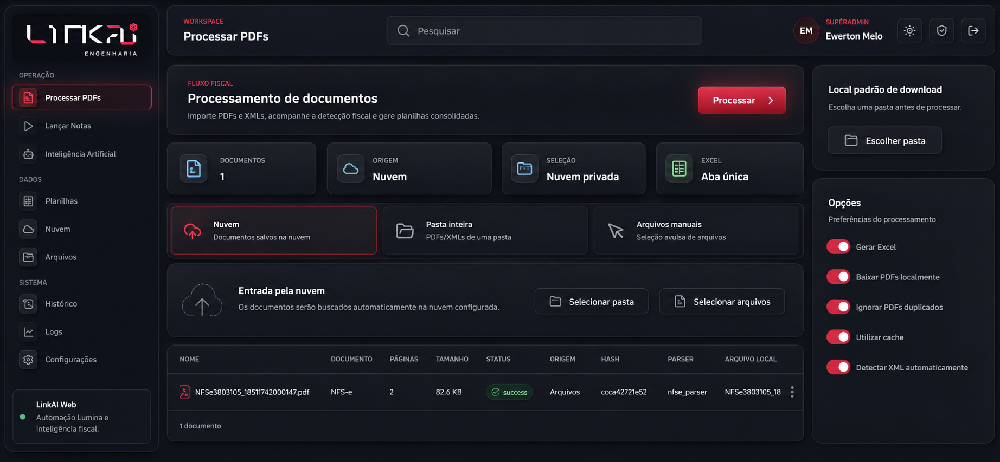

<p align="center">
  
</p>

<h1 align="center">LINKAI</h1>

<p align="center">
  Automação fiscal, processamento inteligente de documentos e operação conectada para a construção civil.
</p>

<p align="center">
  <a href="https://linkai.2lock.app.br">Aplicação publicada</a>
  ·
  <a href="https://github.com/GIT2LOCK/linkai">Repositório</a>
</p>

<p align="center">
  
  
  
  
</p>

## Visão geral

O LINKAI é uma plataforma empresarial da LINKAI Engenharia para organizar rotinas fiscais e reduzir trabalho manual na operação de documentos. O projeto combina uma interface React/Tauri, um serviço Python de processamento e integrações com armazenamento em nuvem e o ERP Lumina.

O sistema mantém uma separação clara entre as responsabilidades:

- **Processar PDFs:** leitura, identificação do layout fiscal e geração de XML normalizado.
- **Excel opcional:** exportação estruturada somente quando o usuário solicitar.
- **Nuvem:** seleção e processamento de documentos armazenados em bucket privado.
- **Lançar Notas:** automação do ERP Lumina sob demanda.
- **Notícias e indicadores:** acompanhamento diário de informações relevantes para a construção civil.
- **Operação:** histórico, logs, arquivos, planilhas, configurações e inteligência artificial.

> O processamento de PDFs e a geração de XML não dependem do Lumina. A automação do Lumina é usada apenas nos fluxos que precisam interagir com o ERP.

## Produto em uso

### Notícias e indicadores

<p align="center">
  
</p>

### Processamento fiscal

<p align="center">
  
</p>

## Capacidades principais

### Documentos fiscais

- Seleção de arquivos manuais, pastas locais ou documentos na nuvem.
- Leitura de PDFs com PyMuPDF e suporte arquitetural para OCR.
- Detecção determinística do layout antes da escolha do parser.
- Parsers especializados para NFS-e de São Paulo e NF-e DANFE modelo 55.
- Preservação de itens, tributos, parcelas, totais, validações e metadados de origem.
- Cache, hash SHA-256, prevenção de duplicidade e processamento de subpastas.

### XML e Excel

- O PDF é convertido sempre para XML normalizado no formato `linkai.documento-fiscal.v1`.
- Esse XML é um formato interno estruturado do LINKAI; ele não substitui o XML oficial autorizado pela SEFAZ.
- A geração de Excel é opcional e pode ser ativada pelo usuário.
- A exportação organiza documentos, itens, parcelas, tributos e validações em abas próprias.
- No ambiente web, o arquivo é entregue para download no navegador do usuário.

### Automação Lumina

- Execução somente mediante ação explícita do usuário.
- Serviço Python desacoplado da interface React.
- Comunicação por API FastAPI quando o processamento estiver hospedado em outra máquina.
- Execução local e suporte a serviço publicado na rede.

## Identidade visual

O produto usa uma linguagem escura, técnica e discreta, com profundidade neumórfica controlada e glassmorphism apenas em superfícies estratégicas.

| Token | Valor | Uso |
| --- | --- | --- |
| Fundo principal | `#080B11` | Área de trabalho |
| Sidebar | `#0D1119` | Navegação lateral |
| Superfície | `#111720` | Cards e painéis |
| Superfície elevada | `#161D27` | Controles e áreas de destaque |
| Texto principal | `#F4F6FA` | Títulos e dados importantes |
| Texto secundário | `#A0A8B5` | Descrições e informações auxiliares |
| Destaque LINKAI | `#E72C50` | Ações e estados ativos |
| Destaque claro | `#FF3B62` | Hover, foco e realces |
| Sucesso | `#42D886` | Processamento concluído |

Assets oficiais:

- `frontend/src/assets/linkai-logo.png` para superfícies escuras.
- `frontend/src/assets/linkai-logo-light.png` para superfícies claras.
- `frontend/src/assets/linkai-icon.png` para usos compactos.

## Arquitetura

```text
linkai/
|-- backend/                  API FastAPI e serviços de integração
|   |-- api/                  Endpoints web e bridge de comandos
|   |-- models/               Contratos de entrada e saída
|   `-- services/             Orquestração do processamento
|
|-- lumina_bot/               Dependências e núcleo fiscal Python
|   |-- core/                 Leitor, detector, processador e writers
|   |-- models/               Modelos fiscais normalizados
|   |-- parsers/              Parsers especializados por layout
|   `-- requirements.txt      Dependências Python
|
|-- frontend/                 Aplicação React, Vite e Tauri
|   |-- src/assets/           Logo e identidade visual
|   |-- src/components/       Componentes compartilhados
|   |-- src/layouts/          Shell e navegação
|   |-- src/pages/            Telas operacionais
|   `-- src-tauri/            Empacotamento desktop
|
|-- docs/                     Documentação e capturas do produto
|-- scripts/                  Utilitários de desenvolvimento
|-- run-linkai-web.ps1        Inicialização local
|-- stop-linkai-web.ps1       Parada dos serviços locais
`-- README.md
```

## Fluxo de processamento

```text
Usuário escolhe arquivos, pasta ou nuvem
                ↓
API recebe os documentos
                ↓
Leitor extrai texto e coordenadas do PDF
                ↓
Detector identifica o layout fiscal
                ↓
Parser especializado cria o modelo normalizado
                ↓
XML LinkAI é gerado sempre
                ↓
Excel é gerado somente se solicitado
                ↓
Resultado é disponibilizado na interface
```

## API de processamento

O serviço FastAPI fica em `backend/api/server.py`:

| Método | Endpoint | Finalidade |
| --- | --- | --- |
| `GET` | `/health` | Verificar disponibilidade |
| `POST` | `/invoke` | Executar comandos da bridge |
| `POST` | `/uploads/documents` | Processar documentos |
| `POST` | `/uploads/pdfs` | Processar PDFs enviados |

Em ambiente publicado, defina `LINKAI_PROCESSING_URL` com a URL pública do serviço. Prefira HTTPS quando a interface também estiver em HTTPS.

## Configuração

### Frontend

```env
VITE_SUPABASE_URL=https://seu-projeto.supabase.co
VITE_SUPABASE_ANON_KEY=sua-chave-anonima
LINKAI_PROCESSING_URL=https://seu-endereco-do-servico.example
```

### Backend

```env
SUPABASE_URL=https://seu-projeto.supabase.co
SUPABASE_SERVICE_ROLE_KEY=
SUPABASE_BUCKET=
SUPABASE_FOLDER=
LINKAI_ALLOWED_ORIGINS=https://seu-dominio.example
LINKAI_PROCESSING_TOKEN=
LINKAI_BRIDGE_TOKEN=
```

Chaves administrativas, senhas e tokens pertencem somente ao backend. Nunca versionar valores reais em `.env` ou no código-fonte.

## Desenvolvimento local

### Frontend web

```powershell
cd frontend
npm install
npm run dev
```

### Serviço Python

```powershell
py -3.12 -m venv lumina_bot\.venv
.\lumina_bot\.venv\Scripts\Activate.ps1
python -m pip install -r backend\requirements.txt
python -m uvicorn backend.api.server:app --host 127.0.0.1 --port 8765
```

Para acesso pela rede:

```bash
source lumina_bot/.venv/bin/activate
python -m uvicorn backend.api.server:app --host 0.0.0.0 --port 8765
```

Verifique a API:

```bash
curl http://127.0.0.1:8765/health
```

Scripts auxiliares:

```powershell
.\run-linkai-web.ps1
.\stop-linkai-web.ps1
```

## Build e testes

```powershell
cd frontend
npm run build
npm run lint
cd ..

python -m unittest discover -s tests -v
```

Os testes fiscais cobrem detecção de layout, NFS-e de São Paulo, NF-e DANFE modelo 55, itens, tributos, parcelas, validações e geração do XML normalizado.

## Segurança operacional

- Não versionar `.env`, tokens, senhas, chaves administrativas ou `SERVICE_ROLE_KEY`.
- Usar a chave anônima somente no frontend quando necessário.
- Manter a chave de serviço somente no backend.
- Proteger endpoints de processamento com token quando expostos na rede.
- Restringir CORS aos domínios autorizados em produção.
- Usar HTTPS no domínio público da API.
- Não salvar arquivos do usuário em diretórios públicos do servidor.

## Contribuição

1. Crie uma branch descritiva a partir de `main`.
2. Faça alterações pequenas e relacionadas ao objetivo da tarefa.
3. Execute build, lint e testes aplicáveis.
4. Confira `git diff` e `git status --ignored` antes do commit.
5. Nunca inclua credenciais, PDFs, planilhas ou logs no commit.

## Licença e propriedade

Projeto privado da 2LOCK / LINKAI Engenharia. O código, a identidade visual e os fluxos de automação pertencem ao projeto e não devem ser redistribuídos sem autorização.
